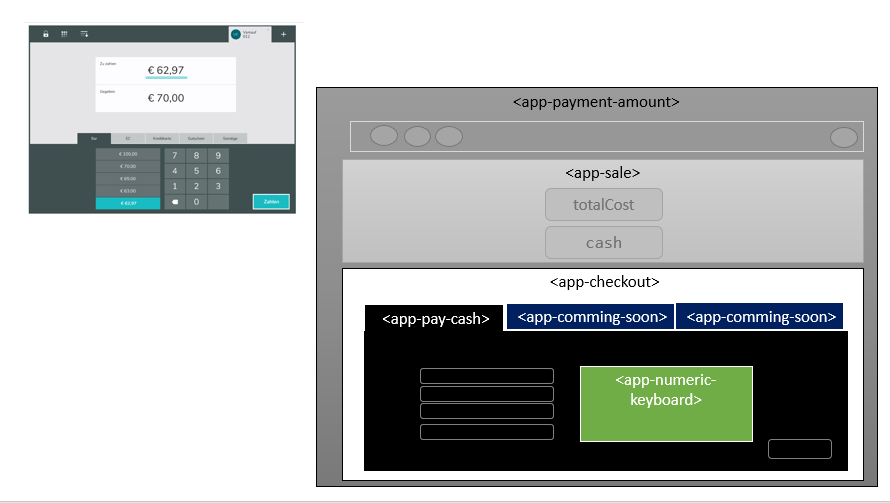

# Calculate Change Money (Geldstueckelung) 🖥 🛍 ✅

## Actions 

## Documentation 📖

This project was generated with [Angular CLI](https://github.com/angular/angular-cli) version 8.3.12.

### To run app on your own computer 🚀 
* Clone this repository `git clone git@github.com:bahadorpour/calculate-change-money.git`
* `cd calculate-change-money`
* `npm install`
* Run `ng serve` for a dev server
* Visit [http://localhost:4200](http://localhost:4200)

### Libraries and frameworks used:

+ [Bootstrap 4](https://getbootstrap.com/)
+ [Sweet alert](https://github.com/sweetalert2/ngx-sweetalert2) : A responsive, customizable, accessible (wai-aria) replacement for javascript's popup boxes .
+ [Font Awesome](https://github.com/FortAwesome/angular-fontawesome) : Vector icons and social logos.
+ [Simple-keyboard](https://hodgef.com/simple-keyboard/): A Javascript Virtual Keyboard - Customizable, responsive and lightweight.
### App structure

### Projekt Beschreibung auf Deutsch
  + Das Programm soll zwei Eingabefelder „zu zahlen“ und „gegeben“ beinhalten. Anzeige: Rechtsbündig, als Währung formatiert, eingegebene Werte rechts angehängt. Die Beträge sind in Eurocent einzugeben. (Beispiel: 6297 für 62.97 EUR)
Minimum ist 1 Maximum ist 100000
  + Als Kassierer möchte ich die Differenz zwischen „zu zahlen“ und „gegeben“ ablesen können. Dazu möchte ich in dem „zu zahlen“ Feld mit der Maus über einen Ziffernblock den Betrag eingeben können, den ein Kunde zahlen muss.
  + Durch Drücken der Enter Taste im Feld „zu zahlen“ soll die Eingabe des Betrages beendet werden.
  + Um mir unnötige Eingaben zu ersparen, soll das Programm mir max. 5 Buttons mit Beträgen neben dem Ziffernblock anzeigen, die der Kunde mir voraussichtlich geben wird.
  + Danach möchte ich auf einen der Button drücken oder alternativ über den Ziffernblock den Betrag eingeben, den der Kunde mir gibt.
  + In einem modalen Fenster (freie Design Wahl) soll das Programm mir das Rückgeld anzeigen. Nach dem Schließen des Fensters kann ich mit einer erneuten Eingabe beginnen.

  + Beispiel: Der Kunde hat 89,90€ zu bezahlen. Für diese Zahlung wäre die folgende  Kombination der Buttons denkbar: 89,90 – 90,00 – 100,00 – 200,00

## Further help 📋

* Code scaffolding :  Run `ng generate component component-name`
* Build : Run `ng build`
* Running unit tests : Run `ng test`
* Running end-to-end tests : Run `ng e2e`
* Help : Run `ng help` or go check out the [Angular CLI README](https://github.com/angular/angular-cli/blob/master/README.md).

## Contributing 📧 🎯

PRs and issues are always welcome. Feel free to submit any issues you have at:
[issues](https://github.com/bahadorpour/calculate-change-money/issues)
